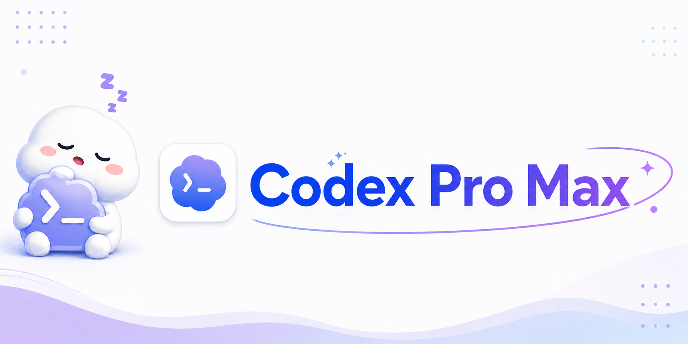
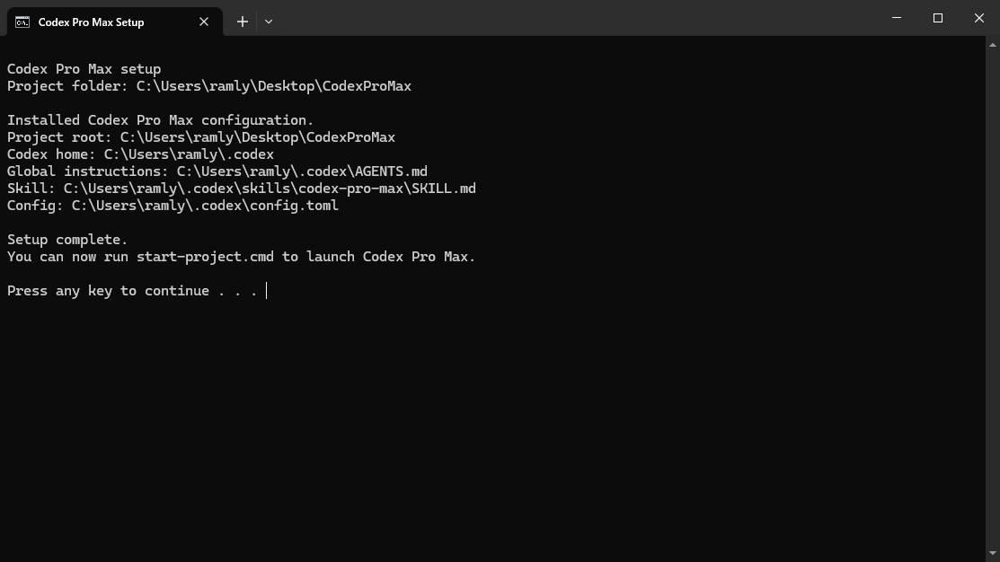
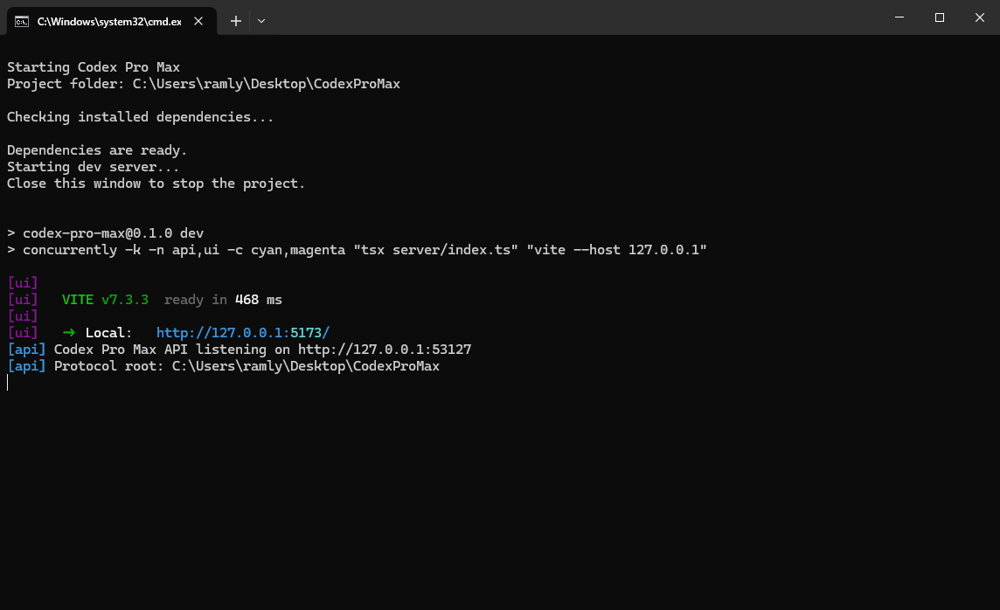
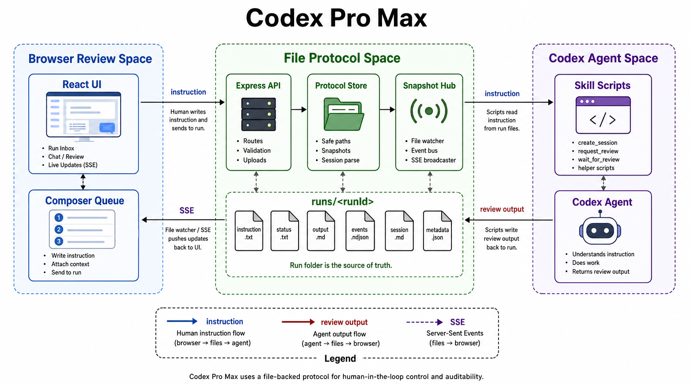
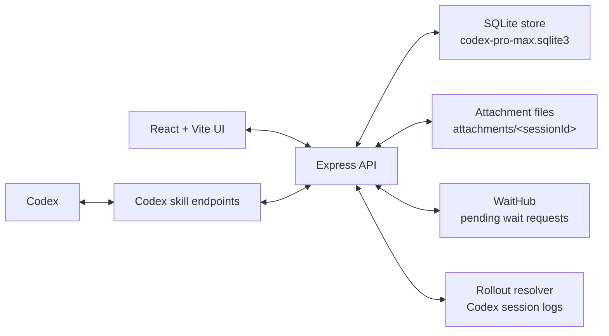
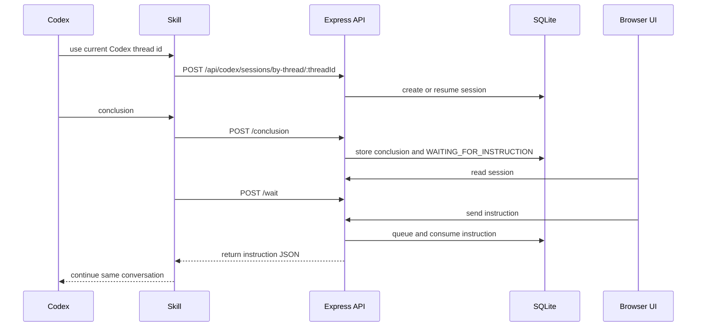
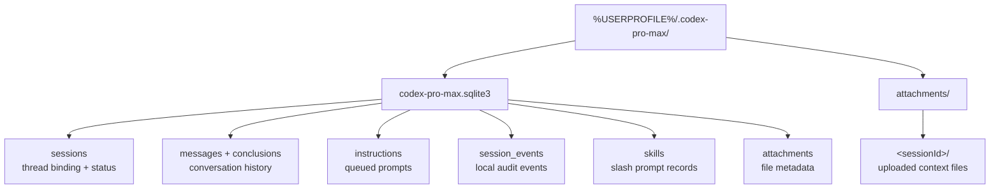
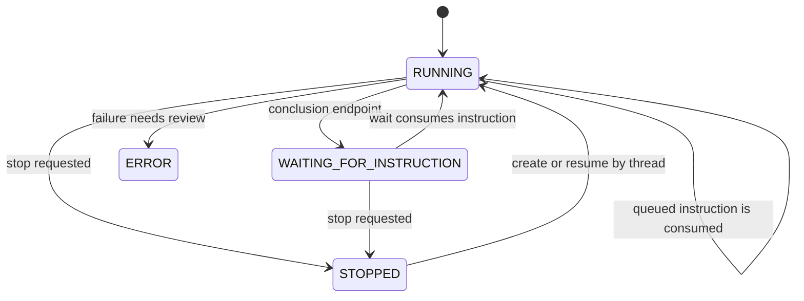

# Codex Pro Max

<p align="center">
  
</p>

<p align="center">
  
  
  
  
  
  
</p>

Codex Pro Max helps you keep working with Codex without interrupting the same conversation.

I built this so Codex can do the work, send its conclusion to Codex Pro Max, wait there for your next prompt, and then continue from the same Codex chat. You do not need to steer the original Codex thread with another message just to keep it moving, and you do not need to start a new conversation.

The workflow is simple: ask Codex to work, review the conclusion in Codex Pro Max, reply there, and let Codex continue from where it stopped.

<p align="center">
  
</p>

## What It Helps With

Codex Pro Max helps when you want Codex to keep working step by step without losing the same conversation.

- Read Codex's latest conclusion in a browser.
- Send the next prompt from Codex Pro Max.
- Keep the same Codex session going after every reply.
- Type ahead while Codex is busy.
- Keep session data locally under `%USERPROFILE%\.codex-pro-max`.

<p align="center">
  
</p>

## Requirements

- Windows.
- Codex installed.
- Node.js 20 or newer. Node.js 24 is recommended.
- npm.
- PowerShell.

## How To Install

### 1. Run Setup

From the project folder, double-click `setup.cmd` or run:

```bat
.\setup.cmd
```

`setup.cmd` installs these things for Codex:

| Installed item | Where it goes | Why it matters |
| --- | --- | --- |
| Codex Pro Max skill | `%USERPROFILE%\.codex\skills\codex-pro-max` | Gives Codex the backend endpoint flow it needs to create sessions, submit conclusions, and wait for your next prompt. |
| Codex config entry | `%USERPROFILE%\.codex\config.toml` | Enables the installed skill for Codex. |

If Codex was already open, restart it after running setup so it can load the new skill.

To remove these installed Codex files later, run:

```bat
.\uninstall.cmd
```

The uninstaller removes the Codex Pro Max skill directory and its Codex config entry.

The uninstaller leaves `%USERPROFILE%\.codex-pro-max` in place so your session records are not removed with the app configuration.

<p align="center">
  
</p>

### 2. Start Codex Pro Max

Run:

```bat
.\start.cmd
```

This command checks dependencies, installs missing packages if needed, and starts the local project.
Session records are stored in `%USERPROFILE%\.codex-pro-max` by default. To use a different storage folder, set `CODEX_PRO_MAX_ROOT` or `CODEX_PRO_MAX_DATA_ROOT` before running `start.cmd`.

When it is running, open:

```text
http://127.0.0.1:53128
```

Codex Pro Max also uses this helper address in the background:

```text
http://127.0.0.1:53127
```

Keep the command window open while you use Codex Pro Max. Closing it stops the project.

<p align="center">
  
</p>

<p align="center">
  
</p>

## How To Use

### 1. Open Codex And Chat

Open Codex and start a normal chat.

Because `setup.cmd` installed the skill and Codex config, Codex knows what to do:

1. Start a new Codex Pro Max session for the current Codex thread.
2. Do your requested work.
3. Submit the conclusion to Codex Pro Max.
4. Wait for your next prompt.

You do not need to manually create a session or call the backend endpoints yourself. Codex uses the installed skill and instructions.

### 2. Continue From Codex Pro Max

After Codex finishes a task, Codex Pro Max shows the conclusion in the browser.

Type your next prompt in Codex Pro Max. Once Codex receives it, it continues the same Codex session, works until the next conclusion, writes that conclusion back into Codex Pro Max, and waits again.

Upload a file and insert its `@attachment-name` mention into the prompt when Codex needs that file. The wait response keeps the chat message readable in the UI and adds the stored local file path for Codex when that mentioned attachment is delivered.

Use the download button in the session toolbar to export the latest user turn, AI messages, tool calls, task events, and edited-file diffs from the bound rollout log as Markdown.

That is the main loop:

```text
Codex chat -> Codex does work -> conclusion appears in Codex Pro Max
Codex Pro Max prompt -> Codex continues -> next conclusion appears
```

<p align="center">
  
</p>

## Daily Workflow

1. Run `start.cmd`.
2. Open `http://127.0.0.1:53128`.
3. Open Codex.
4. Send your first prompt in Codex.
5. Read the conclusion in Codex Pro Max.
6. Send follow-up prompts from Codex Pro Max.
7. Close the `start.cmd` window when you are done.

<p align="center"><strong>[daily-workflow.png]</strong></p>

## What You Should See

When everything is working:

- Codex Pro Max shows a session in the left sidebar.
- The selected session shows Codex's latest conclusion.
- The session status changes to `WAITING_FOR_INSTRUCTION` when Codex is waiting for you.
- The prompt box lets you send the next instruction.
- Codex continues after receiving that instruction.

<p align="center"><strong>[waiting-for-review-screen.png]</strong></p>

## Project Layout

```text
CodexProMax/
  src/                         Express API, SQLite store, rollout readers, and React UI
  setup/skills/codex-pro-max/  Installable Codex skill
  public/                      Static app files
  old/                        Archived file-protocol implementation and README assets
  AGENTS.md                    Repo instructions for the backend endpoint loop
  setup.cmd                    Installs the Codex skill and config
  uninstall.cmd                Removes the installed Codex skill and config entry
  start.cmd                    Starts Codex Pro Max
```

Runtime state lives outside this tree at `%USERPROFILE%\.codex-pro-max` unless `CODEX_PRO_MAX_ROOT` or `CODEX_PRO_MAX_DATA_ROOT` points somewhere else.

## Commands

| Command | Purpose |
| --- | --- |
| `.\setup.cmd` | Installs the Codex Pro Max skill and Codex config entry. |
| `.\uninstall.cmd` | Removes the installed Codex Pro Max skill and Codex config entry. |
| `.\start.cmd` | Installs missing dependencies if needed, then starts the app. |
| `npm run dev` | Starts the Express API and Vite UI together. |
| `npm test` | Runs the API, store, UI helper, and endpoint-flow tests. |
| `npm run build` | Type-checks the project and builds the production UI. |

## Technical Reference

### System Architecture

<p align="center">
  
</p>

This diagram shows the ownership boundaries in the local system. The browser UI talks to the Express API, the API reads and writes SQLite under `%USERPROFILE%\.codex-pro-max`, and uploaded attachments stay on disk under the same data root. Codex reaches the API through the installed skill endpoints. The API resolves the exact Codex rollout log from the thread id so the browser and Codex stay coordinated without sharing process memory.



### Review Loop

This sequence is one complete human review cycle. Codex creates or reopens a session by Codex thread id, submits its conclusion through the backend, and waits. The browser sees the updated session through the API, the user sends the next instruction, and the pending `/wait` request returns that instruction to the same Codex conversation. Sessions bind to their Codex thread id and resolved rollout path instead of guessing the current conversation from the newest global rollout log.



### Session Storage

SQLite is the source of truth under the data root. Session rows keep the Codex thread binding and current status, message and conclusion rows keep the readable conversation, instruction rows hold queued prompts until `/wait` consumes them, and event rows keep local audit context. Attachment bytes stay under the data root and SQLite stores their metadata and paths.



### Status Model

The session status is a coordination flag, not a background job queue. A normal loop moves from `RUNNING` to `WAITING_FOR_INSTRUCTION` after Codex submits an answer, then back to `RUNNING` when `/wait` consumes the next instruction. There is no delivered-instruction status. `ERROR` and `STOPPED` are visible states for cases that need human attention or resume behavior.



### Key Modules

| Path | Role |
| --- | --- |
| `src/ui/App.tsx` | Main browser session view, composer, queue, attachments, skills, and dialogs. |
| `src/ui/api.ts` | Frontend API client for sessions, instructions, uploads, skills, and live usage. |
| `src/app.ts` | Express routes, request validation, uploads, Codex endpoints, and wait coordination. |
| `src/database.ts` | SQLite migrations, sessions, messages, conclusions, instructions, attachments, events, and slash skills. |
| `src/rolloutResolver.ts` | Resolves the rollout log and Codex live session id from a Codex thread id. |
| `src/codexLiveUsage.ts` | Reads rollout activity, token usage, thinking records, and export slices from rollout logs. |
| `src/waitHub.ts` | Holds pending wait requests until an instruction arrives or a session stops. |
| `setup/skills/codex-pro-max/SKILL.md` | Installed Codex endpoint flow for create/resume, conclusion, and wait. |

### API Surface

| Endpoint | Purpose |
| --- | --- |
| `GET /api/health` | Reads local service paths and health metadata. |
| `GET /api/healthy` | Health probe used before Codex enables the skill flow. |
| `GET /api/sessions` | Lists browser session summaries. |
| `GET /api/sessions/:sessionId` | Reads one session with messages, instructions, and attachments. |
| `GET /api/sessions/:sessionId/exports/latest-ai-messages` | Downloads a Markdown export for the latest AI work after the current user turn. |
| `POST /api/sessions/:sessionId/instructions` | Queues the next instruction from the browser. |
| `POST /api/sessions/:sessionId/attachments` | Uploads one attachment. |
| `POST /api/sessions/:sessionId/stop` | Stops one session and wakes pending waits. |
| `GET /api/skills` | Lists saved slash skills for the composer. |
| `POST /api/codex/sessions/by-thread/:threadId` | Creates or resumes the Codex session binding. |
| `POST /api/codex/sessions/by-thread/:threadId/conclusion` | Stores Codex's latest conclusion. |
| `POST /api/codex/sessions/by-thread/:threadId/wait` | Waits for and consumes the next instruction. |
| `GET /api/codex-live/rollout/:threadId` | Resolves the Codex rollout log for a thread id. |

## Codex Skill Contract

Codex should use these backend endpoints instead of creating session state by hand:

| Endpoint | Purpose |
| --- | --- |
| `POST /api/codex/sessions/by-thread/:threadId` | Creates or reopens the session for the current Codex thread. |
| `POST /api/codex/sessions/by-thread/:threadId/conclusion` | Writes the latest answer and sets `WAITING_FOR_INSTRUCTION`. |
| `POST /api/codex/sessions/by-thread/:threadId/wait` | Waits until your next prompt exists, consumes it, and returns it as JSON. |

## Validate Changes

Run:

```bash
npm test
npm run build
```

## License And Responsible Use

Codex Pro Max is licensed under the MIT License. See [`LICENSE`](old/LICENSE).

Use this project only in lawful, authorized, and responsible environments. Do not use it to abuse services, bypass access controls, violate platform terms, compromise systems, exfiltrate data, harass people, or automate activity you are not authorized to perform.

<p align="center">
  
</p>

<p align="center">
  Thank you for reading this boring README. If you'd like to chip in, just let me know!
</p>
