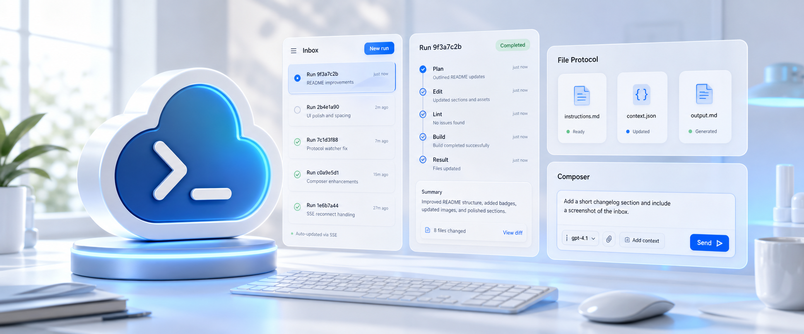
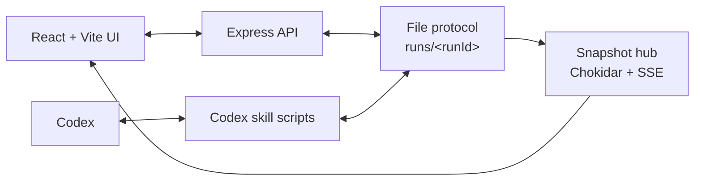
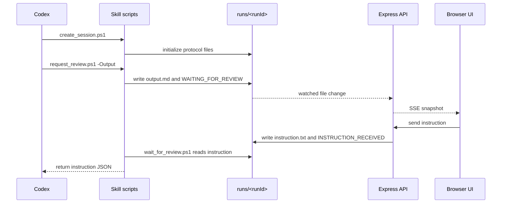
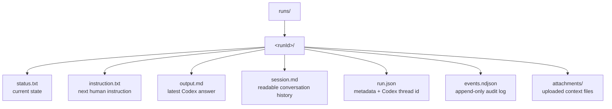
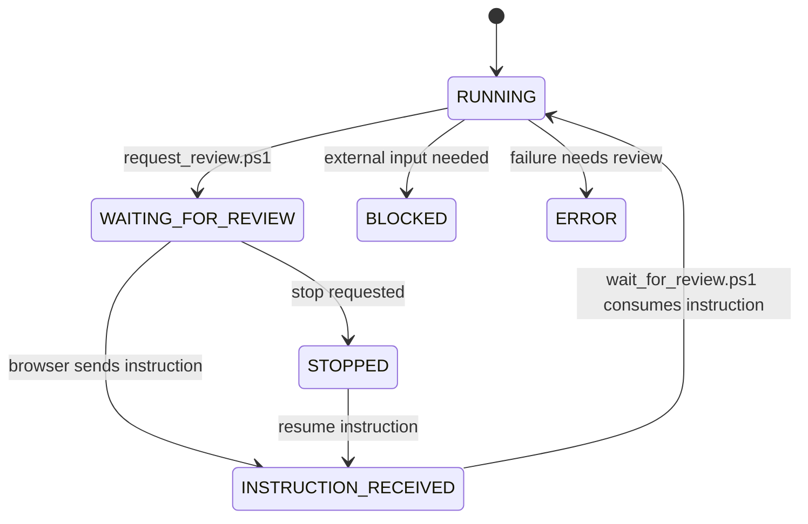

# Codex Pro Max

<p align="center">
  
</p>

<p align="center">
  
  
  
  
  
  
</p>

Codex Pro Max helps you keep working with Codex without interrupting the same conversation.

I built this so Codex can do the work, send its conclusion to Codex Pro Max, wait there for your next prompt, and then continue from the same Codex chat. You do not need to steer the original Codex thread with another message just to keep it moving, and you do not need to start a new conversation.

The workflow is simple: ask Codex to work, review the conclusion in Codex Pro Max, reply there, and let Codex continue from where it stopped.

<p align="center">
  
</p>

## What It Helps With

Codex Pro Max helps when you want Codex to keep working step by step without losing the same conversation.

- Read Codex's latest conclusion in a browser.
- Send the next prompt from Codex Pro Max.
- Keep the same Codex session going after every reply.
- Type ahead while Codex is busy.
- Keep run files locally in the `runs/` folder.

<p align="center">
  
</p>

## Requirements

- Windows.
- Codex installed.
- Node.js 20 or newer. Node.js 24 is recommended.
- npm.
- PowerShell.

## How To Install

### 1. Run Setup

From the project folder, double-click `setup.cmd` or run:

```bat
.\setup.cmd
```

`setup.cmd` installs three things for Codex:

| Installed item | Where it goes | Why it matters |
| --- | --- | --- |
| Codex Pro Max skill | `%USERPROFILE%\.codex\skills\codex-pro-max` | Gives Codex the scripts it needs to create sessions, submit conclusions, and wait for your next prompt. |
| System instruction file | `%USERPROFILE%\.codex\AGENTS.md` | Tells Codex when and how to use Codex Pro Max. |
| Codex config entry | `%USERPROFILE%\.codex\config.toml` | Enables the installed skill for Codex. |

If Codex was already open, restart it after running setup so it can load the new skill and instructions.

To remove these installed Codex files later, run:

```bat
.\uninstall.cmd
```

The uninstaller removes the Codex Pro Max skill directory and its Codex config entry. It also removes `%USERPROFILE%\.codex\AGENTS.md` when that file still matches this project's installed instructions; if you edited that file, the uninstaller preserves it unless you run `.\uninstall.cmd -ForceAgents`.

<p align="center">
  
</p>

### 2. Start Codex Pro Max

Run:

```bat
.\start-project.cmd
```

This command checks dependencies, installs missing packages if needed, and starts the local project.

When it is running, open:

```text
http://127.0.0.1:5173
```

Codex Pro Max also uses this helper address in the background:

```text
http://127.0.0.1:53127
```

Keep the command window open while you use Codex Pro Max. Closing it stops the project.

<p align="center">
  
</p>

<p align="center">
  
</p>

## How To Use

### 1. Open Codex And Chat

Open Codex and start a normal chat.

Because `setup.cmd` installed the skill, `AGENTS.md`, and Codex config, Codex knows what to do:

1. Start a new Codex Pro Max session.
2. Do your requested work.
3. Write the conclusion into Codex Pro Max.
4. Wait for your next prompt.

You do not need to manually create a run folder or run the PowerShell scripts yourself. Codex uses the installed skill and instructions.

### 2. Continue From Codex Pro Max

After Codex finishes a task, Codex Pro Max shows the conclusion in the browser.

Type your next prompt in Codex Pro Max. Once Codex receives it, it continues the same Codex session, works until the next conclusion, writes that conclusion back into Codex Pro Max, and waits again.

That is the main loop:

```text
Codex chat -> Codex does work -> conclusion appears in Codex Pro Max
Codex Pro Max prompt -> Codex continues -> next conclusion appears
```

<p align="center">
  
</p>

## Daily Workflow

1. Run `start-project.cmd`.
2. Open `http://127.0.0.1:5173`.
3. Open Codex.
4. Send your first prompt in Codex.
5. Read the conclusion in Codex Pro Max.
6. Send follow-up prompts from Codex Pro Max.
7. Close the `start-project.cmd` window when you are done.

<p align="center"><strong>[daily-workflow.png]</strong></p>

## What You Should See

When everything is working:

- Codex Pro Max shows a run in the left sidebar.
- The selected run shows Codex's latest conclusion.
- The run status changes to `WAITING_FOR_REVIEW` when Codex is waiting for you.
- The prompt box lets you send the next instruction.
- Codex continues after receiving that instruction.

<p align="center"><strong>[waiting-for-review-screen.png]</strong></p>

## Project Layout

```text
CodexProMax/
  src/                         React + Vite browser UI
  server/                      Express API and file protocol logic
  setup/skills/codex-pro-max/  Installable Codex skill
  public/                      Static app files
  assets/readme/               README images and GIFs
  runs/                        Local runtime state, ignored by git
  AGENTS.md                    System instructions installed by setup.cmd
  setup.cmd                    Installs the Codex skill and config
  uninstall.cmd                Removes the installed Codex skill and config entry
  start-project.cmd            Starts Codex Pro Max
```

## Commands

| Command | Purpose |
| --- | --- |
| `.\setup.cmd` | Installs the Codex Pro Max skill, `AGENTS.md`, and Codex config entry. |
| `.\uninstall.cmd` | Removes the installed Codex Pro Max skill, matching `AGENTS.md`, and Codex config entry. |
| `.\start-project.cmd` | Installs missing dependencies if needed, then starts the app. |
| `npm run dev` | Starts the Express API and Vite UI together. |
| `npm test` | Runs backend, frontend, and skill-script tests. |
| `npm run build` | Type-checks the project and builds the production UI. |
| `npm run preview` | Serves the production build locally. |

## Technical Reference

### System Architecture

<p align="center">
  
</p>



### Review Loop



### File Protocol



### Status Model



### Key Modules

| Path | Role |
| --- | --- |
| `src/App.tsx` | Main browser inbox, run view, composer, queue, attachments, and dialogs. |
| `src/api.ts` | Frontend API client for snapshots, actions, uploads, teammates, and Codex live history. |
| `src/hooks/useSnapshotStream.ts` | Subscribes to live manager snapshots over SSE. |
| `src/shared/protocol.ts` | Shared protocol types, status names, file names, and response shapes. |
| `server/app.ts` | Express routes, request validation, upload handling, and run actions. |
| `server/protocolStore.ts` | Safe path handling, run metadata, protocol files, session parsing, attachments, and audit events. |
| `server/snapshotHub.ts` | Chokidar watcher and Server-Sent Events broadcasting. |
| `setup/skills/codex-pro-max/scripts/*.ps1` | Scripts used by Codex to create sessions, request review, and wait for instructions. |

### API Surface

| Endpoint | Purpose |
| --- | --- |
| `GET /api/snapshot` | Reads the manager inbox snapshot. |
| `GET /api/events` | Streams live snapshots over SSE. |
| `GET /api/runs/:runId/snapshot` | Reads one run. |
| `GET /api/runs/:runId/files/:fileName` | Reads a protocol file preview. |
| `POST /api/runs/:runId/action` | Writes the next instruction. |
| `POST /api/runs/:runId/upload` | Uploads one attachment. |
| `DELETE /api/runs/:runId/attachments/:fileName` | Deletes one attachment. |
| `DELETE /api/runs/:runId/messages` | Clears `session.md`. |
| `POST /api/runs/:runId/stop` | Requests the run to stop. |
| `DELETE /api/runs/:runId` | Deletes a run folder. |
| `GET /api/codex-live/sessions` | Lists local Codex live session logs. |
| `GET /api/codex-live/sessions/:sessionId` | Reads one Codex live session history. |

## Codex Skill Contract

Codex should use these scripts instead of creating run folders by hand:

| Script | Purpose |
| --- | --- |
| `create_session.ps1` | Creates or reopens a run and returns `runDir`. |
| `request_review.ps1` | Writes the latest answer and sets `WAITING_FOR_REVIEW`. |
| `wait_for_review.ps1` | Waits until your next prompt exists, then returns it as JSON. |

## Validate Changes

Run:

```bash
npm test
npm run build
```

## License And Responsible Use

Codex Pro Max is licensed under the MIT License. See [`LICENSE`](LICENSE).

Use this project only in lawful, authorized, and responsible environments. Do not use it to abuse services, bypass access controls, violate platform terms, compromise systems, exfiltrate data, harass people, or automate activity you are not authorized to perform.

<p align="center">
  
</p>

<p align="center">
  Thank you for reading this boring README. If you'd like to chip in, just let me know!
</p>
