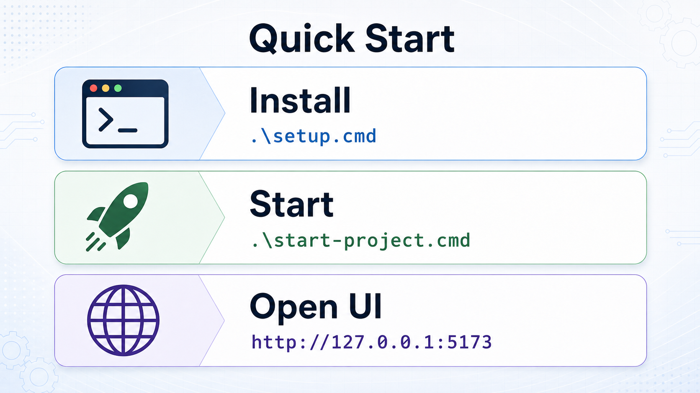
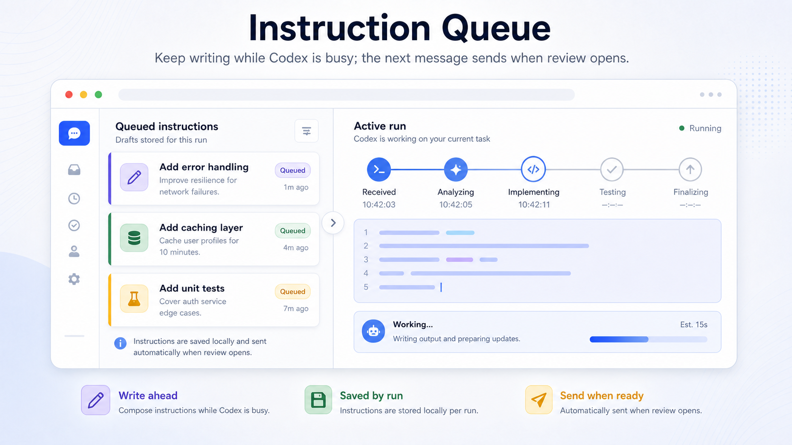
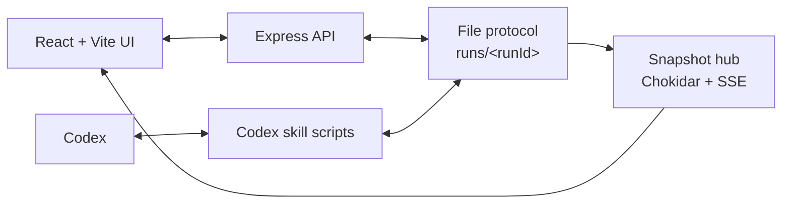
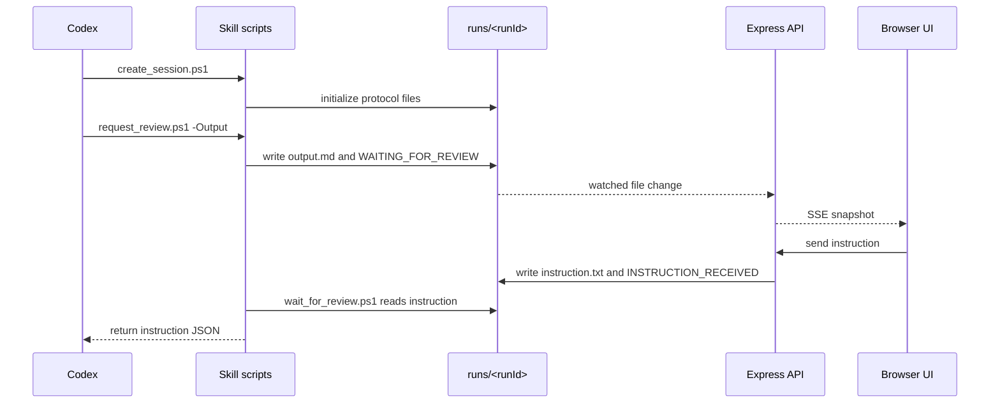
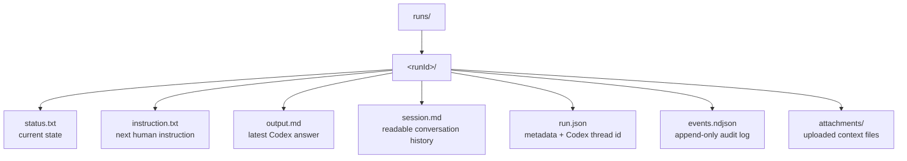
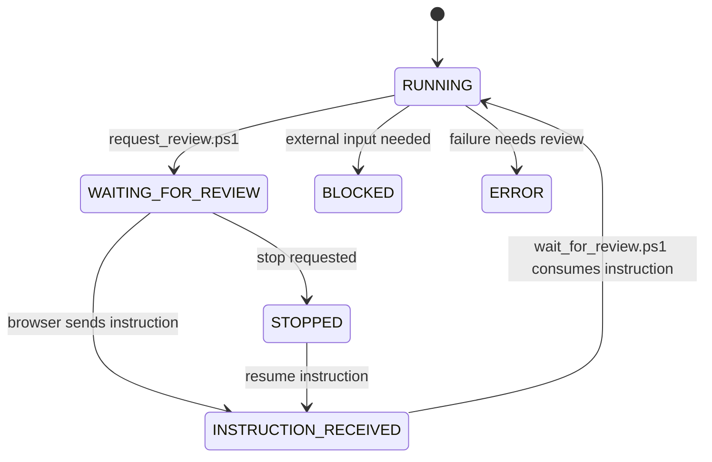

# Codex Pro Max

<p align="center">
  
</p>

<p align="center">
  
  
  
  
  
  
</p>

Codex Pro Max is a local browser inbox for Codex runs.

I built this so I can chat with Codex directly from Codex Pro Max without interrupting the same conversation. Codex can do the work, send the answer to the browser, wait there for my next instruction, and then continue the same run again.

That makes the workflow simple: review the answer, type the next instruction, and keep going. Have fun.

<p align="center">
  
</p>

## What It Does

<p align="center">
  
</p>

Codex Pro Max gives you:

- A browser inbox for Codex runs.
- One selected run view with the latest answer.
- A composer for sending the next instruction.
- A queue so you can keep writing while Codex is busy.
- Attachments and previews for run context.
- Protocol file previews for debugging.
- Live local updates through Server-Sent Events.
- A file-backed protocol, so there is no database to set up.

Use it when you want Codex to pause after a task, show you the result in a separate UI, and then resume the same conversation after you reply.

## Tags

`codex` `human-in-the-loop` `review-inbox` `local-first` `file-protocol` `server-sent-events` `react` `vite` `typescript` `express` `windows` `automation`

## Quick Start

<p align="center">
  
</p>

### Requirements

- Windows.
- Node.js 20 or newer. Node.js 24 is recommended.
- npm.
- PowerShell.

### Install The Codex Skill

From the project folder, run:

```bat
.\setup.cmd
```

The setup script copies the Codex Pro Max skill into your Codex home folder and updates Codex configuration so Codex can use the review scripts.

### Start The App

Run:

```bat
.\start-project.cmd
```

Then open:

```text
http://127.0.0.1:5173
```

The local API runs on:

```text
http://127.0.0.1:53127
```

## Demo Media

<!-- Add the project screenshot and workflow GIF here later. -->

## Daily Workflow

<p align="center">
  
</p>

The normal loop is:

1. Codex calls `create_session.ps1` to create or reopen a run.
2. Codex does the requested work.
3. Codex calls `request_review.ps1` with its answer.
4. Codex Pro Max shows that answer in the browser.
5. You send the next instruction from the UI.
6. `wait_for_review.ps1` returns the instruction to Codex.
7. Codex continues the same conversation.

The important rule is that Codex keeps waiting with the same `runDir` until an instruction exists.

## Instruction Queue

<p align="center">
  
</p>

You can type ahead while Codex is busy. Queued instructions are stored in the browser by run id. When the selected run reaches `WAITING_FOR_REVIEW`, the next queued instruction can be sent without losing your draft.

## Project Layout

```text
CodexProMax/
  src/                         React + Vite browser UI
  server/                      Express API and file protocol logic
  setup/skills/codex-pro-max/  Installable Codex skill
  public/                      Static app images
  assets/readme/               README raster figures
  runs/                        Local runtime state, ignored by git
```

## Scripts

| Command | Purpose |
| --- | --- |
| `.\setup.cmd` | Installs the Codex Pro Max Codex skill into your Codex home folder. |
| `.\start-project.cmd` | Installs missing dependencies if needed, then starts the dev app. |
| `npm run dev` | Starts the Express API and Vite UI together. |
| `npm test` | Runs backend, frontend, and skill-script tests. |
| `npm run build` | Type-checks the project and builds the production UI. |
| `npm run preview` | Serves the production build locally. |

## Technical Reference

### System Architecture

<p align="center">
  
</p>



### Review Loop



### File Protocol



### Status Model



### Key Modules

| Path | Role |
| --- | --- |
| `src/App.tsx` | Main browser inbox, run view, composer, queue, attachments, and dialogs. |
| `src/api.ts` | Frontend API client for snapshots, actions, uploads, teammates, and Codex live history. |
| `src/hooks/useSnapshotStream.ts` | Subscribes to live manager snapshots over SSE. |
| `src/shared/protocol.ts` | Shared protocol types, status names, file names, and response shapes. |
| `server/app.ts` | Express routes, request validation, upload handling, and run actions. |
| `server/protocolStore.ts` | Safe path handling, run metadata, protocol files, session parsing, attachments, and audit events. |
| `server/snapshotHub.ts` | Chokidar watcher and Server-Sent Events broadcasting. |
| `setup/skills/codex-pro-max/scripts/*.ps1` | Scripts used by Codex to create sessions, request review, and wait for instructions. |

### API Surface

| Endpoint | Purpose |
| --- | --- |
| `GET /api/snapshot` | Reads the manager inbox snapshot. |
| `GET /api/events` | Streams live snapshots over SSE. |
| `GET /api/runs/:runId/snapshot` | Reads one run. |
| `GET /api/runs/:runId/files/:fileName` | Reads a protocol file preview. |
| `POST /api/runs/:runId/action` | Writes the next instruction. |
| `POST /api/runs/:runId/upload` | Uploads one attachment. |
| `DELETE /api/runs/:runId/attachments/:fileName` | Deletes one attachment. |
| `DELETE /api/runs/:runId/messages` | Clears `session.md`. |
| `POST /api/runs/:runId/stop` | Requests the run to stop. |
| `DELETE /api/runs/:runId` | Deletes a run folder. |
| `GET /api/codex-live/sessions` | Lists local Codex live session logs. |
| `GET /api/codex-live/sessions/:sessionId` | Reads one Codex live session history. |

## Codex Skill Contract

The installed skill lives in:

```text
C:\Users\ramly\.codex\skills\codex-pro-max
```

Codex should use these scripts instead of creating run folders by hand:

| Script | Purpose |
| --- | --- |
| `create_session.ps1` | Creates or reopens a run and returns `runDir`. |
| `request_review.ps1` | Writes the latest answer and sets `WAITING_FOR_REVIEW`. |
| `wait_for_review.ps1` | Waits until a human instruction exists, then returns it as JSON. |

## Validate Changes

Run:

```bash
npm test
npm run build
```

## License And Responsible Use

Codex Pro Max is licensed under the MIT License. See [`LICENSE`](LICENSE).

Use this project only in lawful, authorized, and responsible environments. Do not use it to abuse services, bypass access controls, violate platform terms, compromise systems, exfiltrate data, harass people, or automate activity you are not authorized to perform.

<p align="center">
  
</p>

<p align="center">
  Thank you for reading this boring README. If you'd like to chip in, just let me know!
</p>
